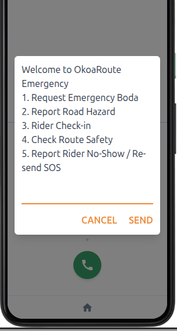
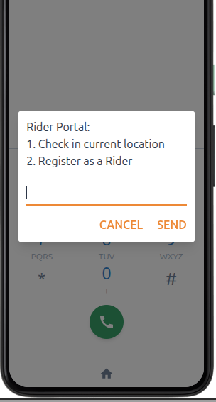
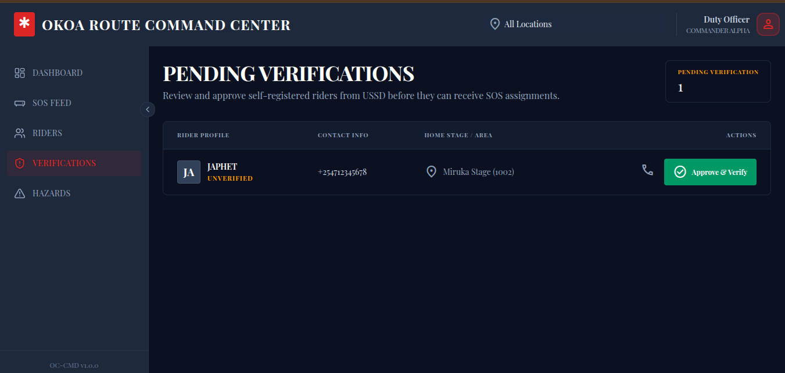
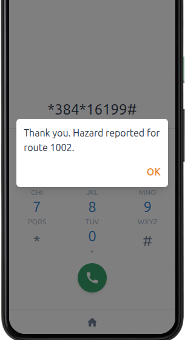
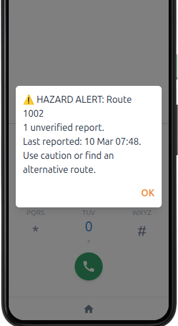
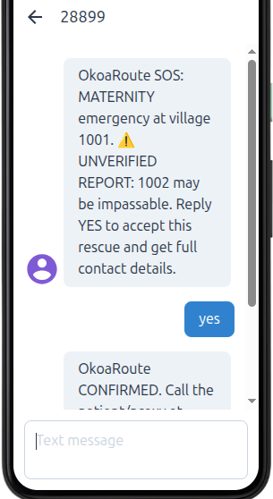

# OkoaRoute: An Offline-First Emergency Dispatch Engine

## 1. The Humanitarian Reality
In November 2019, and again during recent rainy seasons, massive mudslides in West Pokot literally wiped out the Kapenguria-Lodwar highway and swept away bridges. Villages like Nyarkulian and Muino were completely cut off. The Red Cross and military couldn't get standard ambulances or heavy trucks in; they had to rely on ground-level coordination and even drones just to see what was happening.

Traditional ambulances cannot pass, and centralized dispatchers in Nairobi have no real-time data on which mountain routes are actually surviving. Furthermore, standard "Uber for Ambulance" solutions assume the victim has a smartphone, 4G internet, and a downloaded app. When a mother goes into complicated labor at 2:00 AM during a blackout on a cut-off ridge, she does not have 4G. The current tech landscape abandons the most vulnerable people exactly when the infrastructure fails.

## 2. The OkoaRoute Solution
OkoaRoute is an offline-first, decentralized medical dispatch engine built entirely for the basic feature phone (kabambe).
You dial a code (e.g. `*384*99#`), and it automatically finds the nearest safe boda rider to come get you, while making sure they don't get stuck on a flooded road along the way.

## 3. How the Ecosystem Works
OkoaRoute bridges the gap between a feature phone in the mud and a dispatcher's laptop. It pairs a simple offline menu for the victims with a live web dashboard for the NGOs.

### A. Rescuers Onboarding
Local riders dial a USSD and register as ready to receive SOS in cases of emergencies.

| Welcome Menu | Rider Portal |
| :---: | :---: |
|  |  |
*(An illustration of a rider register flow)*

After registration, to prevent data poisoning, an admin must approve the riders from the command center dashboard. Once approved, they can start receiving SOS messages.

  
   
  <i>(An illustration of an admin approving a new rider from the command center)</i>

### B. Crowd Sourcing Data on Affected Areas
Anyone can dial a USSD to report an affected area or hazard routes. Anyone can also check on affected areas via the USSD to plan effectively. Riders also get details of the affected areas when trying a rescue to help them plan better routes.

| Reporting a Hazard | Hazard Alert Check |
| :---: | :---: |
|  |  |
*(An illustration of a user reporting hazards and another user checking conditions of an area)*

To avoid data poisoning, hazards reported by a single user are considered unverified unless reported by an approved rider. Hazards reported by multiple users become verified automatically.

### C. User Calling for SOS Help
A user can call for SOS help and the nearest riders are alerted. The first rider to reply to the message gets the contact details of the victim. The victim also gets the contact details of the rider for assurance and communication.

  
   
  <i>(An illustration of a rider accepting an SOS)</i>

### D. Auto-Healing State Management
The Python/Flask backend utilizes automated cron jobs to track rider availability via state changes and force-close stale jobs, ensuring the rescue fleet never gets bogged down by ghost data.

## 4. Why This Works
Existing solutions build for perfect conditions. OkoaRoute is built for the mud. By turning the existing, highly-organized Boda Boda network into a hazard-aware ambulance fleet and doing it entirely offline, we bridge the critical "first mile" gap in rural healthcare, drastically reducing response times and saving lives.

## 5. Deployment and Github
Command center deployed at: https://humanitarian-hackathon.vercel.app/
Github link at: https://github.com/creeksonJoseph/humanitarian-hackathon